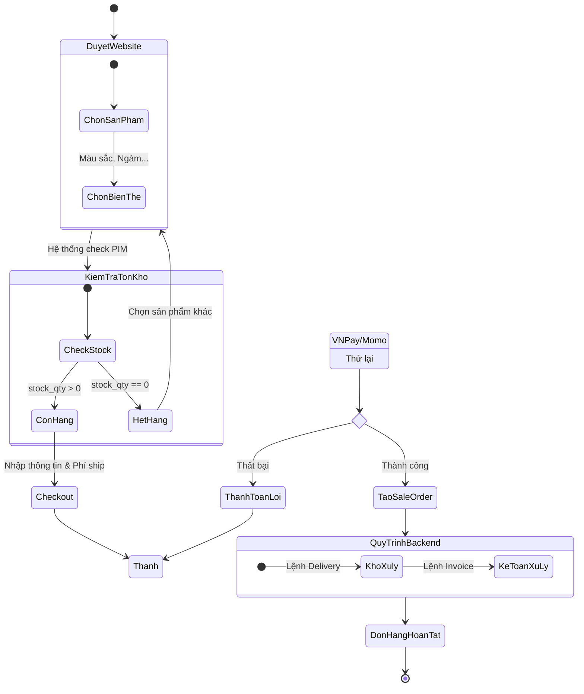

# Software Requirement Specification (SRS) - Kochi Lens System

## 1. Giới thiệu dự án
Dự án xây dựng hệ thống quản lý và bán hàng thiết bị ngành ảnh cho công ty **Kochi Lens**. Hệ thống tập trung vào việc tối ưu hóa quy trình từ lúc khách hàng đặt hàng trực tuyến đến khi bộ phận kho và kế toán hoàn tất nghiệp vụ backend.

---

## Phần 1: Mô hình hóa quy trình (Business Flow)

### 1.1. Sơ đồ Use Case (Use Case Diagram)

Các tác nhân chính tương tác với hệ thống quản lý sản phẩm và đơn hàng:
```mermaid
usecaseDiagram
    actor "Khách hàng" as Customer
    actor "Admin/PIM Manager" as Admin
    actor "Nhân viên Kho" as Warehouse
    actor "Kế toán" as Accountant

    package "Hệ thống Kochi Lens" {
        usecase "Xem sản phẩm & Biến thể" as UC1
        usecase "Quản lý Giỏ hàng" as UC2
        usecase "Thanh toán (VNPay/Momo)" as UC3
        usecase "Thiết lập Sản phẩm (PIM)" as UC4
        usecase "Cập nhật tồn kho Real-time" as UC5
        usecase "Xác nhận đóng gói (Delivery)" as UC6
        usecase "Xuất hóa đơn (Invoice)" as UC7
    }

    Customer --> UC1
    Customer --> UC2
    Customer --> UC3
    
    Admin --> UC4
    Admin --> UC5
    
    Warehouse --> UC5
    Warehouse --> UC6
    
    Accountant --> UC7
```


### 1.2. Sơ đồ Activity (Activity Diagram)
Luồng nghiệp vụ từ khi khách hàng chọn hàng đến khi đơn hàng hoàn tất:


1.  **Bắt đầu:** Khách hàng truy cập website và chọn thiết bị ảnh.
2.  **Kiểm tra tồn kho:** Hệ thống truy xuất dữ liệu từ PIM (Quản lý sản phẩm) để hiển thị trạng thái Real-time.
3.  **Đặt hàng:** Khách hàng thêm vào giỏ hàng và nhập thông tin giao hàng.
4.  **Thanh toán:** Khách hàng chọn thanh toán qua VNPay/Momo.
    * *Thất bại:* Quay lại bước thanh toán hoặc hủy đơn.
    * *Thành công:* Hệ thống tạo **Sale Order**, trừ tồn kho tương ứng.
5.  **Xử lý Backend:** * Kho xác nhận lệnh đóng gói (Delivery).
    * Kế toán xác nhận xuất hóa đơn (Invoice).
6.  **Kết thúc:** Đơn hàng hoàn tất.

---

## Phần 2: Đặc tả chức năng (Functional Requirements)

Tập trung vào chức năng **[2.1] Quản lý Sản phẩm (PIM)** thông qua các User Stories:

| ID | Vai trò | User Story |
|:---|:---|:---|
| **US01** | Admin | Là một quản trị viên, tôi muốn tạo các biến thể sản phẩm (như ngàm Sony E, Canon RF, màu Black/Silver) để phân loại thiết bị chính xác. |
| **US02** | Khách hàng | Là một khách hàng, tôi muốn thấy số lượng tồn kho cập nhật ngay lập tức khi tôi chọn biến thể để tránh đặt nhầm hàng đã hết. |
| **US03** | Nhân viên kho | Là nhân viên kho, tôi muốn mỗi biến thể sản phẩm có một mã SKU/Barcode riêng biệt để việc quét mã đóng gói không bị nhầm lẫn. |
| **US04** | Kế toán | Là nhân viên kế toán, tôi muốn thiết lập mức thuế VAT riêng cho từng nhóm sản phẩm (như máy ảnh 10%, phụ kiện 8%) để tính toán hóa đơn chính xác. |
| **US05** | Khách hàng | Là một khách hàng, tôi muốn nhận được email xác nhận đơn hàng ngay sau khi thanh toán để tôi an tâm về giao dịch. |

---

## Phần 3: Đặc tả dữ liệu (Data Schema)

Cấu trúc các trường thông tin cần thiết trong cơ sở dữ liệu:

### 3.1. Partner (Khách hàng)
* **partner_id**: Mã định danh (Primary Key).
* **name**: Tên khách hàng hoặc tên công ty.
* **tax_code**: Mã số thuế (áp dụng cho khách hàng doanh nghiệp B2B).
* **shipping_address**: Địa chỉ nhận hàng.
* **type**: Phân loại (Guest, B2C, B2B).

### 3.2. Product (Sản phẩm)
* **product_id**: Mã định danh (Primary Key).
* **sku**: Mã quản lý kho (duy nhất cho từng biến thể).
* **barcode**: Mã vạch vật lý.
* **base_price**: Giá bán chưa thuế.
* **tax_rate**: Thuế suất VAT ứng với sản phẩm.
* **variant_info**: Thông tin màu sắc, kích thước, ngàm ống kính.

### 3.3. Order (Đơn hàng)
* **order_id**: Mã định danh (Primary Key).
* **order_number**: Số đơn hàng (Ví dụ: ORD-2026-001).
* **status**: Trạng thái đơn hàng (Draft, Confirmed, Processing, Cancelled).
* **payment_status**: Trạng thái thanh toán (Pending, Paid).
* **total_amount**: Tổng giá trị đơn hàng (đã bao gồm VAT và phí ship).
